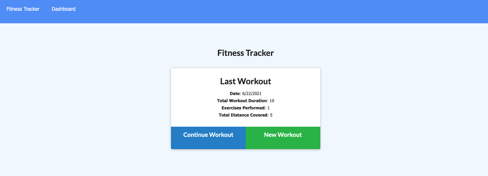
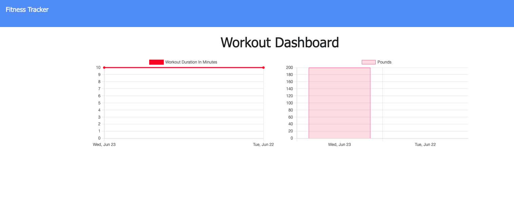

# workout-tracker


## Description

The workout-tracker application allows users to create, view, and track daily workouts. The user can create a new, or add on to a previous workout, and then view their stats in the dashboard, which logs their workout activity.


## Table of Content

[Technologies Used](#Technologies-Used)<br>
[User Story](#User-Story)<br>
[Acceptance Criteria](#Acceptance-Criteria)<br>
[Business Context](#Business-Context)<br>
[Mock Up](#Mock-Up)<br>
[Usage](#Usage)<br>
[Contact](#Contact)<br>
[License](#Contact)<br>

## Technologies Used
```
Javascript
MongoDB
Mongoose
MongoDB Atlas
Express.js
Node.js
Robo3T
Heroku
```

## User Story

* As a user, I want to be able to view create and track daily workouts. I want to be able to log multiple exercises in a workout on a given day. I should also be able to track the name, type, weight, sets, reps, and duration of exercise. If the exercise is a cardio exercise, I should be able to track my distance traveled.

## Business Context

A consumer will reach their fitness goals more quickly when they track their workout progress.

## Acceptance Criteria
When the user loads the page, they should be given the option to create a new workout or continue with their last workout.

The user should be able to:

  * Add exercises to the most recent workout plan.

  * Add new exercises to a new workout plan.

  * View the combined weight of multiple exercises from the past seven workouts on the `stats` page.

  * View the total duration of each workout from the past seven workouts on the `stats` page.


## Mock Up



## Usage

To start the server, enter: 

    npm start

## Contact

For further information, questions, or comments - I can be reached at: 
[johnsoncm](#https://github.com/johnsoncm)

## License


